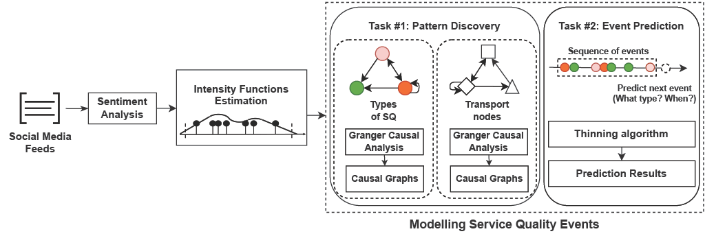

# SentiHawkes: a sentiment-aware Hawkes point process to model service quality of public transport using Twitter data. 
The proposed method comprises of two main tasks, namely pattern discovery and event prediction.



## Introduction 
This is an implementation of SentiHawkes, a sentiment-aware Hawkes point process to model service quality of public transport using Twitter data. 

## Dataset
In this project, four major transport hubs are considered as the case study network due to their current importance on transferring a large number of people. First, a Twitter dataset comprising of more than 32 million tweets is collected. This data is obtained from the Australian Urban Research Infrastructure Network ([AURIN](www.aurin.org.au)). Keywords and spatial proximity to hubs are employed to detect relevant tweets.

Next, tweets are manually labelled and mapped to different aspects of SQ (``Safety, View, Information, Service Reliability, Comfort, Personnel, and Additional Services``). Those tweets that do not fall into any of these aspects are considered as irrelevant to the SQ of public transport and therefore, are discarded (Class -1). 
 
## Quick Start
Compatible with Windows/Linux/OSX systems and only requires MatlabR2016a or newer. To run, just open MATLAB and add paths to the necessary functions.

## Citation
```
Rahimi,  M.M.,et  al.,  2022.  SentiHawkes: a sentiment-aware Hawkes point process to model service quality of public transport using Twitter data. Public Transport, 22.
```

## Author
Masoud Rahimi
- Email: <mmrahimi@student.unimelb.edu.au>
- Linkedin: [Here](https://www.linkedin.com/in/rahimimasoud/)


## Acknowledgments
This project incorporates code from the following repos:
- https://github.com/HongtengXu/Hawkes-Process-Toolkit


